# Anatomy of the prototype

## 1.iOS prototype analysis

### 1.1. Search interface

  1. When we open the application, we are on the search page and we will have an interface like this on an iOS;

  
  
  we can search for any movie...

  2. As an example, I enter the keyword "start"...

  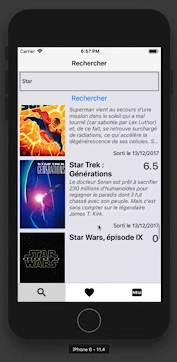

  3. We can click on any result, I click on "Star Wars, episode II" ;

  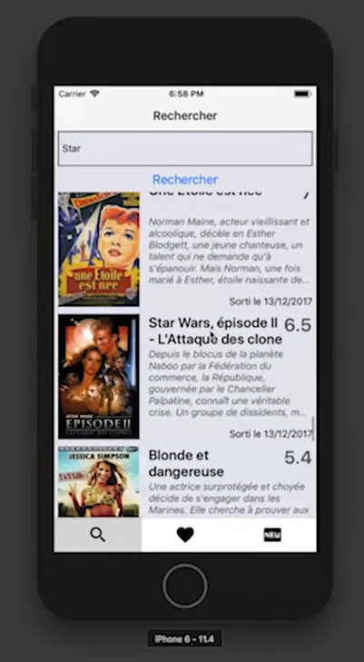

  4. After clicking, we can read the description and add it as our favorite movie or share it with our contacts.

  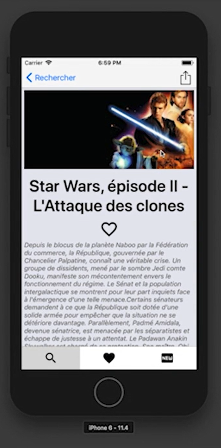

  5. Sharing movie with your contacts; 

  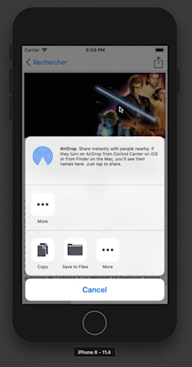

  6. Add as favorite movie;

  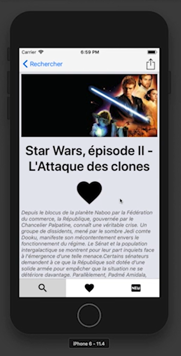

  7. when we add a movie to our favorite movies, in the Search list, there will be a black heart next to indicate that it is a favorite movie;

  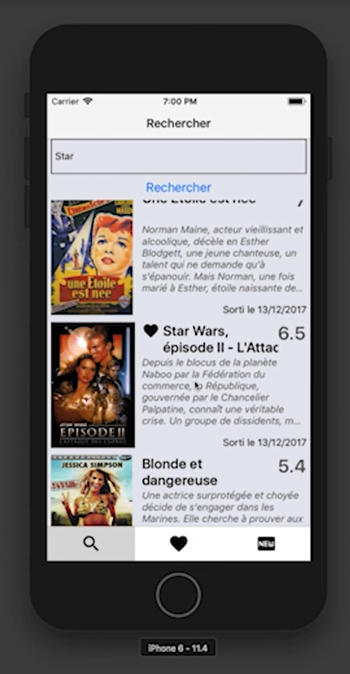

  Now let's go to the "favorite" interface...

### 1.2. Favorite interface
  
  1. Here we can find the movie we just put as a favorite movie;

  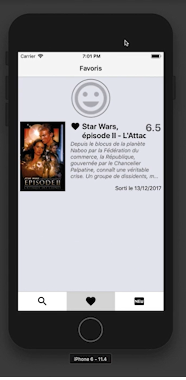

  we can see that the movie we put as a favorite movie is on the list of favorite movies
  
  2. Now, we can click on another movie to add it to our favorites

  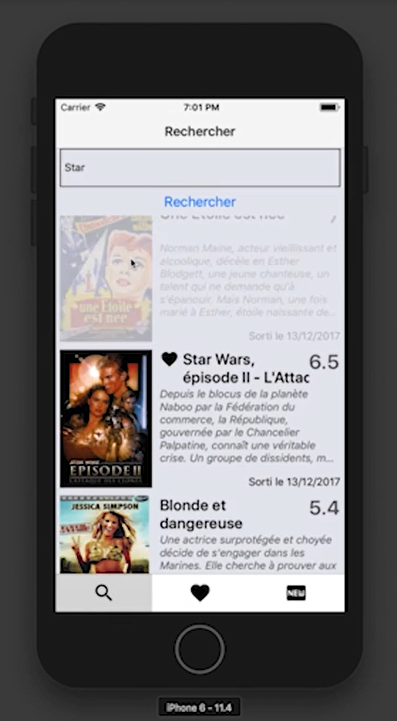

  3. Then,  we click on the heart to place it in the list of favorites

  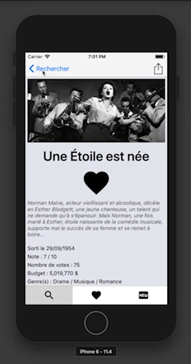

  4. if we go back to the favorite movies we will see the second movie appear

  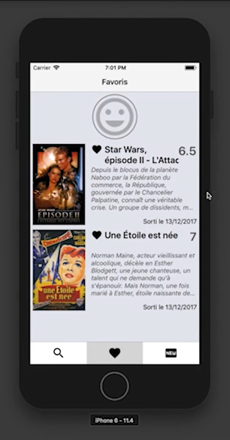

  5. If we click and remove the heart ;

  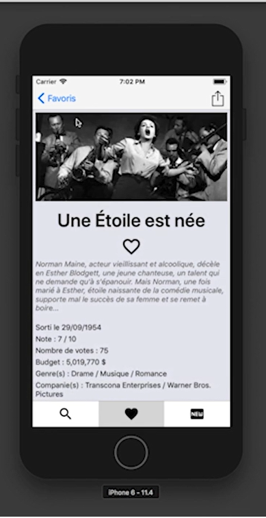 

  6. And when we go back to the favorite movies, we will have :

  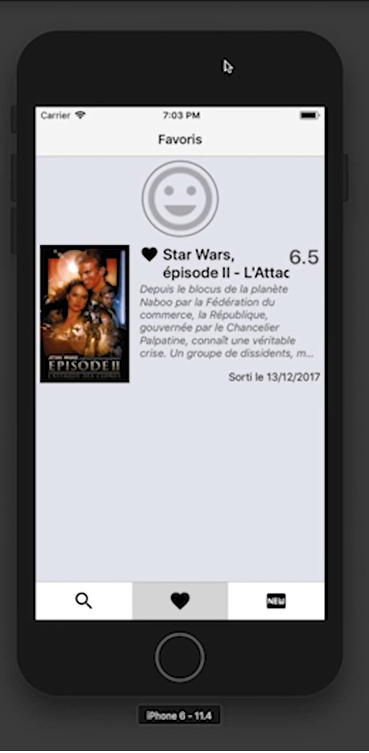 

  7. and just above, in the favorites, there is the possibility to put a profile picture (as the avatar)

  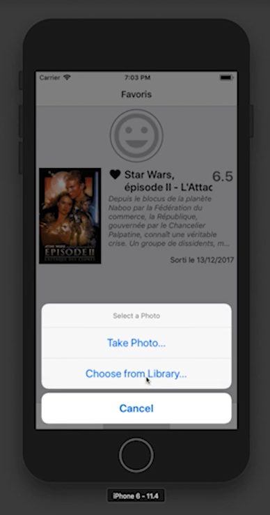

  8. We have a choice between taking a picture or choosing an image in the directory of our phone.

  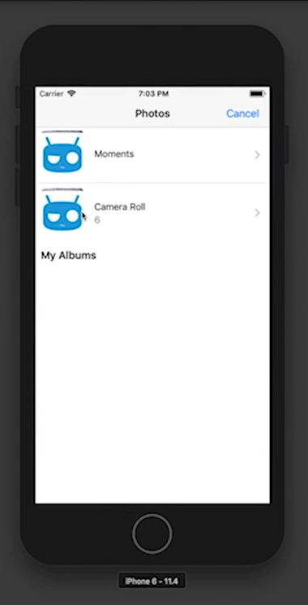

  9. choose the directory of our choice then choose the image that suits us

  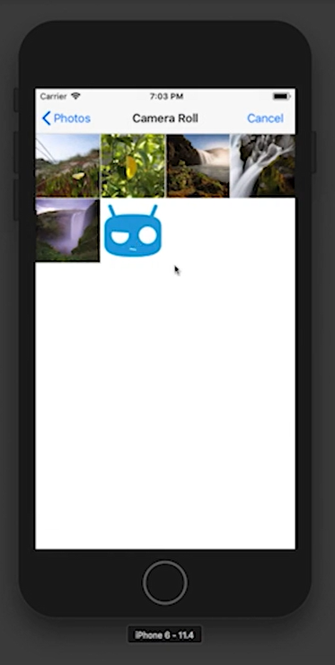

  10. We have a successful change of profile

  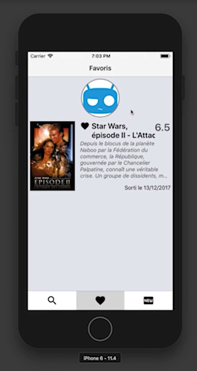

  We're done with the favorites, now switch to the latest interface (News).

###  1.3.News interface

  - In the news interface, we see all new movies, from newest to oldest;

  The ranking is relative to the date. No need to search.

  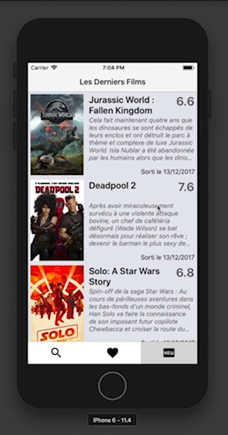

Here is our mobile application in a few images.

## 2. Prototype phase division

Name  | ID | Division of labor
:-:|:-:|:-:
 KIB  | 32666002 | iOS interface |

 

Prototyping Report is being written ... We will update this file according to the pace of progress of our work... 

Thank you for reading our post!
